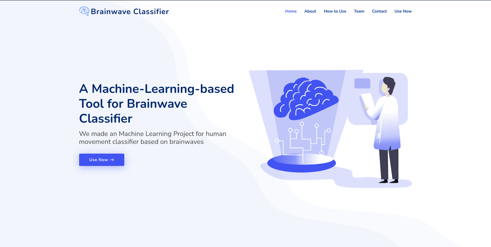
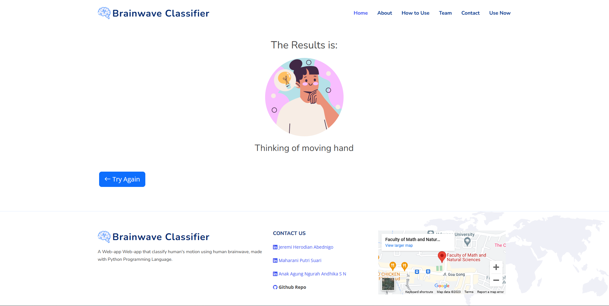

# Brainwave Classification

### Klasifikasi Gerakan Manusia dari Gelombang Sinyal Otak

``
Dengan menggunakan teknologi Convolutional Neural Network (CNN) dan bahasa pemrograman Python, kami menciptakan Web-app untuk memahami berbagai gerakan manusia, yaitu posisi rest dan keinginan menggerakkan tangan. Teknologi CNN memungkinkan kami untuk melatih model yang cerdas dan responsif, memberikan pengalaman yang lebih baik dalam mendeteksi dan merespons gerakan manusia secara real-time.Dengan antarmuka yang intuitif, Anda dapat dengan mudah berinteraksi dengan web-app kami dan mengalami kecanggihan teknologi klasifikasi gelombang otak.
``

### How to install and run locally


Clone the project

```bash
  git clone https://github.com/UAS-PPM-EEG-Classification-CNN/BrainwaveCLFWeb.git
```

Go to the project directory

```bash
  cd BrainwaveCLFWeb
```

Install dependencies

```bash
  pip install -r requirements.txt
```

Start the server

```bash
  python manage.py runserver
```

### Screenshot App

#### Landing page


#### Classification Result

